Long life cycles and parasite growth and development in the definitive host
================

Do parasites with long and short life cycles differ in how they exploit their definitive host? In this analysis, I explore whether there are associations between life cycle length, prepatent periods, and parasite growth. Begin by loading libraries, setting options, and importing data.

``` r
library(dplyr)
library(ggplot2)
library(tidyr)
library(RColorBrewer)
```

``` r
options(stringsAsFactors = FALSE) # never have species lists as factors; always as character vectors

# set theme
theme.o <- theme_update(axis.text = element_text(colour="black", size = 15),
                        axis.title = element_text(colour="black", size = 18, face = "bold", lineheight=0.25),
                        axis.ticks = element_line(colour="black"),
                        panel.border = element_rect(colour = "black",fill=NA),
                        panel.grid.minor=element_blank(),
                        panel.grid.major=element_line(color="gray",linetype = "dotted"),
                        panel.background= element_rect(fill = NA))

# import the life cycle database tables
dataH <- read.csv(file="data/CLC_database_hosts.csv", header = TRUE, sep=",")
dataL <- read.csv(file="data/CLC_database_lifehistory.csv", header = TRUE, sep=",")
```

We are interested in adult parasite growth and development, so we'll restrict the data to worms in their definitive hosts. We also remove measurements on adult males, as we are interested in prepatent periods (time until egg production).

``` r
# filter to adult stages
dataL <- filter(dataL, Stage == 'adult', (Sex == 'f' | is.na(Sex)) ) # remove adult males
```

Select relevant columns.

``` r
dataL <- select(dataL, Parasite.species, Parasite.group, Development.time, Temp)%>%
  filter(!is.na(Development.time))
```

Next, we add life cycle lengths to the adult sizes.

``` r
maxLCL <- group_by(dataH, Parasite.species)%>%summarize(maxLCL = max(Host.no))
minLCL <- filter(dataH, Facultative == "no")%>%
  group_by(Parasite.species)%>%summarise(minLCL = length(unique(Host.no)))
dataL <- left_join(dataL, maxLCL)
dataL <- left_join(dataL, minLCL)
```

Make life cycle length a nice factor for plotting.

``` r
dataL <- mutate( dataL, maxLCL.fac = if_else(maxLCL > 3, "4", as.character(maxLCL)))%>%
  mutate(maxLCL.fac = factor(maxLCL.fac, labels = c("1", "2", "3", ">3")))
```

Most of the prepatent periods were recorded in vertebrates (high temperatures).

``` r
ggplot(dataL, aes(x = Temp)) + geom_histogram()
```

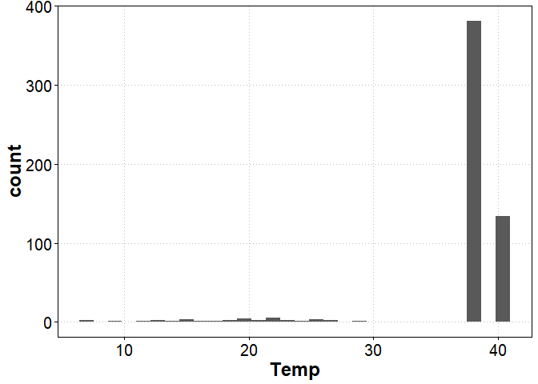

A right-skewed distribution of developmental times, which looks better log transformed.

``` r
ggplot(dataL, aes(x = Development.time)) + geom_histogram()
```

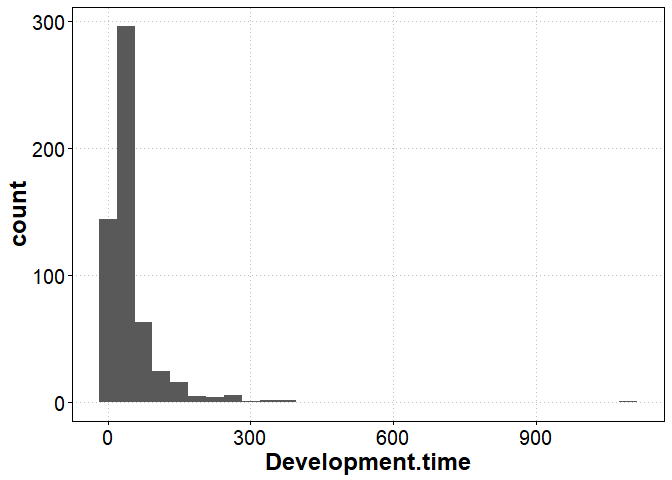

In general, higher temperatures are associated with shorter development times, as we would expect, but the relationship is not strong. Within endotherms, parasite prepatent periods vary several fold.

``` r
ggplot(dataL, aes(x = Temp, y = log(Development.time))) +
  geom_smooth(method = 'lm') +
  geom_point(aes(color = maxLCL.fac), alpha = 0.3)
```

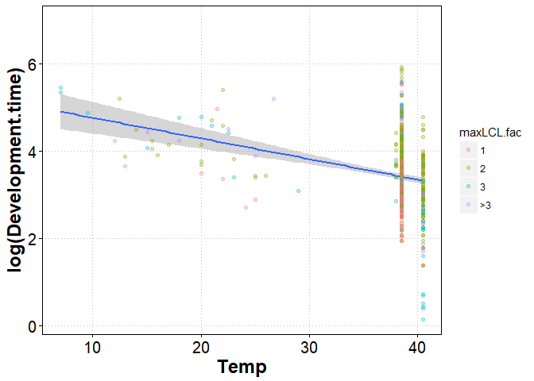

Prepatent periods also do not vary with life cycle length.

``` r
ggplot(dataL, aes(x = maxLCL.fac, y = log(Development.time))) +
  geom_boxplot(outlier.color = 'white') +
  geom_jitter(height = 0, alpha = 0.5, width = 0.2)
```

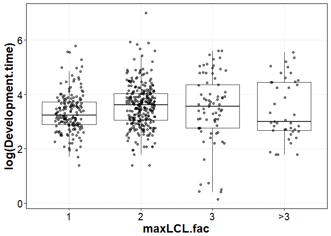

We can make the same plot for just worms reproducing in endothermic vertebrates, but again there is not much of a pattern.

``` r
ggplot(filter(dataL, Temp > 35),
              aes(x = maxLCL.fac, y = log(Development.time))) +
  geom_boxplot(outlier.color = 'white') +
  geom_jitter(height = 0, alpha = 0.5, width = 0.2)
```

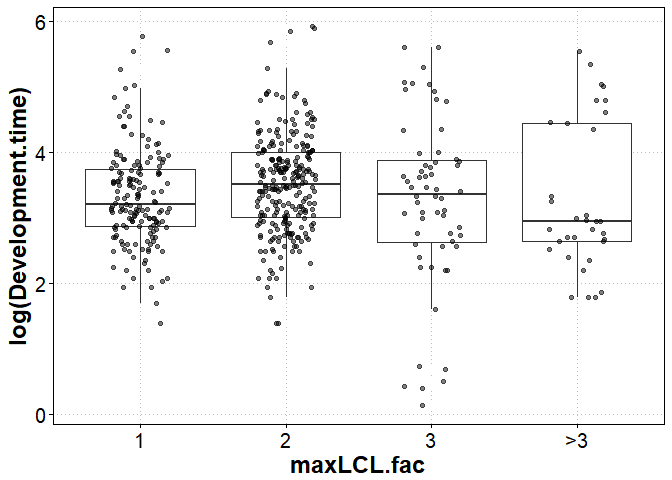

We can be even more specific, by splitting the data into parasite groups. Now the patterns become more complicated. There is not much of a pattern in nematodes, while cestodes with 3-host cycles tend to have short prepatent periods (like Schistocephalus).

``` r
ggplot(filter(dataL, Temp > 35),
              aes(x = maxLCL.fac, y = log(Development.time))) +
  geom_boxplot(outlier.color = 'white') +
  geom_jitter(height = 0, alpha = 0.5, width = 0.2) +
  facet_grid(~Parasite.group)
```

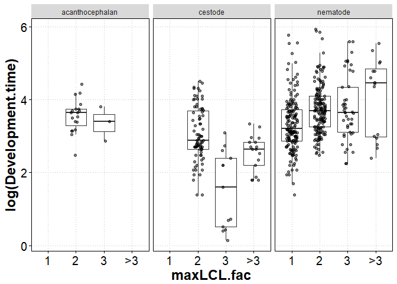

Across the whole data, the median prepatent period of a simple host cycle is ~12 days shorter than in a 2-host cycle, or ~0.3 standard deviations.

``` r
group_by(dataL, maxLCL.fac)%>%
  summarize(n = n(), med_dt = median(Development.time, na.rm = T), sd_dt = sd(Development.time, na.rm = T))
```

    ## # A tibble: 4 x 4
    ##   maxLCL.fac     n med_dt    sd_dt
    ##       <fctr> <int>  <dbl>    <dbl>
    ## 1          1   171   25.5 43.28630
    ## 2          2   280   37.0 80.15207
    ## 3          3    73   35.0 65.74082
    ## 4         >3    41   20.0 62.16808

The difference is marginally larger when we only focus on nematodes of endothermic vertebrates. Still, though, there is no clear trend fo life cycle length to impact prepatent periods.

``` r
filter(dataL, Temp > 35, Parasite.group == "nematode")%>%
  group_by(maxLCL.fac)%>%
  summarize(n = n(), med_dt = median(Development.time, na.rm = T), sd_dt = sd(Development.time, na.rm = T))
```

    ## # A tibble: 4 x 4
    ##   maxLCL.fac     n med_dt    sd_dt
    ##       <fctr> <int>  <dbl>    <dbl>
    ## 1          1   164 24.625 43.39680
    ## 2          2   160 40.000 56.11104
    ## 3          3    44 38.000 66.41278
    ## 4         >3    16 86.000 74.65964

``` r
sd_dt <- select(dataL, maxLCL.fac, dt = Development.time)%>%
  mutate(complex = if_else(maxLCL.fac == '1', 'simple', 'complex'),
         dt = 
           ( log10(dt) - mean( log10(dt), na.rm=T) ) / sd( log10(dt), na.rm = T))
group_by(sd_dt, complex)%>%
  summarize(meandt_sd = mean(dt, na.rm = T))
```

    ## # A tibble: 2 x 2
    ##   complex   meandt_sd
    ##     <chr>       <dbl>
    ## 1 complex  0.07143258
    ## 2  simple -0.16458735

So there is not a trend for prepatent periods. What about growth? Let's reimport the life history data table, and isolate the body size of worms in the definitive host and their size right before entering the definitive host.

``` r
dataL <- read.csv(file="data/CLC_database_lifehistory.csv", header = TRUE, sep=",")

dataL <- mutate(dataL, biovolume = 
                  if_else(Shape %in% c("cylinder", "thread-like", "whip"), 
                          pi * (Width/2)^2 * Length, # calculate volume as a cylinder
                          if_else(Shape %in% c("coiled", "sphere", "ellipsoid"),
                                  4/3 * pi * Length/2 * Width/4, # calculate volume as a ellipsoid
                                  Length * Width # calculate volume as area for remaining ribbon, leaf shapes
                                  )),
                biovolume = biovolume * 1.1) # covert to biomass with assumed 1.1. g/cm3 tissue density
dataL <- filter(dataL, is.na(Asexual)) # remove asexual species
```

Make table identifying the definitive host, as well as the host before the definitive host.

``` r
adults <- filter(dataL, Stage == 'adult', (Sex == 'f' | is.na(Sex)) )%>%
  select(Parasite.species, Host.no)%>%
  distinct()%>%
  mutate(Host_bef_def = Host.no - 1)
```

Add this variable to the main table, and filter the table to just the definitive host and the stage before entering the definitive host.

``` r
dataL <- left_join(dataL, select(adults, - Host.no), by = "Parasite.species")
dataL <- filter(dataL,  (Stage == 'adult' & (Sex == 'f' | is.na(Sex))) | Host.no == Host_bef_def)
```

The stage before the definitive host in simple life cycles is the propagule stage. We want to select the stage that best reflects initial parasite size.

``` r
# id species that hatch or not
eggos <- filter(dataL, Host.no == 0)%>%
  select(Parasite.species, Egg.hatch)%>%
  mutate(propagule_selector = if_else(Egg.hatch != "eaten", "free larva", "egg"))%>%
  select(-Egg.hatch)%>%
  na.omit%>%distinct()

# determine whether there is a size measurement for embryo or egg stages
eggos2 <- filter(dataL, Host.no == 0)%>%
  select(Parasite.species, Stage, biovolume)%>%
  group_by(Parasite.species, Stage)%>%
  summarize(x = sum(!is.na(biovolume)))

# combine and spread these two tables
eggos2 <- left_join(eggos, eggos2)
eggos2 <- spread(na.omit(eggos2), Stage, x)

# identify the stage where growth starts for each species
eggos2 <- mutate(eggos2, propagule_selector = if_else(propagule_selector == 'free larva', 'free larva',
                                                       if_else(embryo > 0, 'embryo', 'egg')))

# add selector variable to main life history table
eggos2 <- select(eggos2, Parasite.species, propagule_selector)
dataL <- left_join(dataL, eggos2)
rm(eggos, eggos2)

# remove propagule measurements that do not reflect initial size
dataL <- filter(dataL, !(Host.no == 0 & Stage != propagule_selector))
```

Then we select the necessary columns, create a degree days variable, and average for each 'species stage'.

``` r
dataL.sp <- select(dataL, Parasite.species, Parasite.group, Host.no, Stage, biovolume, Development.time, Temp)%>%
  mutate(Stage = if_else(Stage == 'adult', 'adult', 'preadult'),
         deg_days = Development.time * (Temp - 5))%>%
  group_by(Parasite.species, Parasite.group, Host.no, Stage)%>%
  summarize(biovolume = mean(biovolume, na.rm = T),
            dt = mean(Development.time, na.rm = T),
            deg_days = mean(deg_days, na.rm = T))
```

Add a life cycle variable for plotting

``` r
dataL.sp <- left_join(dataL.sp, maxLCL)
dataL.sp <- mutate( ungroup(dataL.sp), maxLCL.fac = if_else(maxLCL > 3, "4", as.character(maxLCL)))%>%
  mutate(maxLCL.fac = factor(maxLCL.fac, labels = c("1", "2", "3", ">3")))
```

Look at the size that worms enter the definitive host, as a function of life cycle length. Because parasites usually undergo some growth in their intermediate hosts, they typically enter the definitive host at a much larger size.

``` r
ggplot(filter(dataL.sp, Stage == 'preadult'), 
       aes(x = maxLCL.fac, y = log10(biovolume))) +
  geom_boxplot(outlier.color = 'white') +
  geom_jitter(height = 0, alpha = 0.5, width = 0.2) +
  labs(x = "Life cycle length", y = "Size at infection")
```

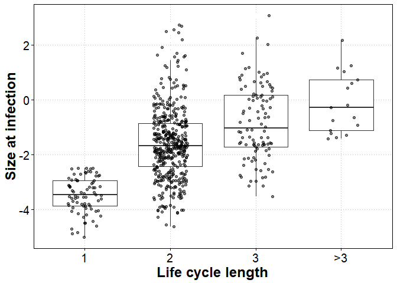

On average, worms are 2 orders of magnitude larger when entering the definitive host.

``` r
filter(dataL.sp, Stage == 'preadult')%>%
  group_by(maxLCL.fac)%>%
  summarize(mean_biov = mean(log10(biovolume), na.rm=T))
```

    ## # A tibble: 4 x 2
    ##   maxLCL.fac  mean_biov
    ##       <fctr>      <dbl>
    ## 1          1 -3.4734503
    ## 2          2 -1.5984893
    ## 3          3 -0.8332808
    ## 4         >3 -0.1098000

The pattern appears relatively consistent within parasite groups.

``` r
ggplot(filter(dataL.sp, Stage == 'preadult'), 
       aes(x = maxLCL.fac, y = log10(biovolume))) +
  geom_boxplot(outlier.color = 'white') +
  geom_jitter(height = 0, alpha = 0.5, width = 0.2) +
  facet_grid(~Parasite.group) +
  labs(x = "Life cycle length", y = "Size at infection")
```

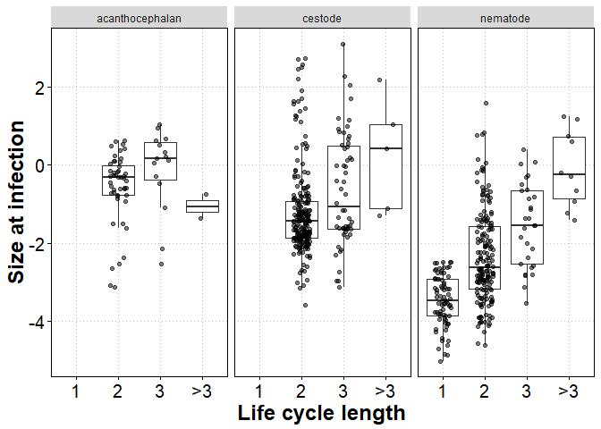

Variation in initial size may go a long way towards explaining the [differences in adult size](https://github.com/dbenesh82/adult_size_life_cycle_length/blob/master/adult_size_lcl.md) between worms with different life cycle lengths. Over the whole data, mean size was about 1.3 orders of magnitude larger for complex life cycle parasites.

``` r
filter(dataL.sp, Stage == 'adult')%>%
  group_by(maxLCL.fac)%>%
  summarize(mean_biov = mean(log10(biovolume), na.rm=T))
```

    ## # A tibble: 4 x 2
    ##   maxLCL.fac   mean_biov
    ##       <fctr>       <dbl>
    ## 1          1 -0.05859164
    ## 2          2  1.23911531
    ## 3          3  1.35477066
    ## 4         >3  2.17390443

Another way to look at this is in standardized terms. It is about 1.4 SD larger.

``` r
sd_biov <- filter(dataL.sp, Stage == 'preadult')%>%select(maxLCL.fac, biovolume)%>%
  mutate(complex = if_else(maxLCL.fac == '1', 'simple', 'complex'),
         biovolume = 
           (log10(biovolume) - mean(log10(biovolume), na.rm=T) ) / sd(log10(biovolume), na.rm = T))
group_by(sd_biov, complex)%>%
  summarize(meanbiov_sd = mean(biovolume, na.rm = T))
```

    ## # A tibble: 2 x 2
    ##   complex meanbiov_sd
    ##     <chr>       <dbl>
    ## 1 complex   0.1695713
    ## 2  simple  -1.2517038

Final reproductive size is the combination of initial size, growth rate, and prepatent period. It appears that initial size variation is the most important contributor to final size, but we can also look at growth rates.

For plotting, we give the size measurement before entering the definitive host a time of zero.

``` r
dataL.sp <- mutate(dataL.sp, time = if_else(Stage == 'preadult', 0, dt),
                   time2 = if_else(Stage == 'preadult', 0, deg_days))
```

Then we restrict the data to just species where a prepatent period has been recorded.

``` r
rm_sp <- filter( ungroup(dataL.sp), Stage == 'adult', is.na(dt))%>%select(Parasite.species)

dataL.sp <- filter(dataL.sp, !(Parasite.species %in% rm_sp$Parasite.species))
```

The plot shows parasite growth trajectories in the definitive host.

``` r
ggplot(dataL.sp, aes(x = time2, y = log10(biovolume), color = maxLCL.fac)) +
  geom_line(aes(group = Parasite.species), alpha = 0.25) +
  geom_point(alpha = 0.5) + 
  coord_cartesian(xlim = c(0,6000)) +
  labs(x = "Degree days")
```

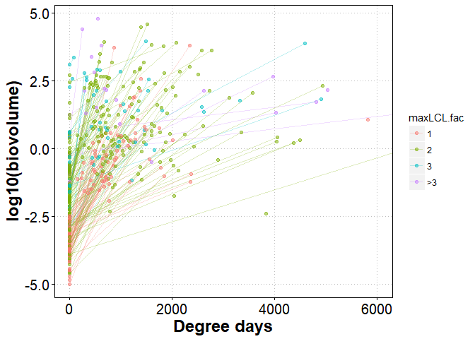

The initial size difference between simple and complex cycles is evident (i.e. the points at time zero). Growth rates, the slopes of the lines, seem to vary substantially, and they do not obviously differ between life cycle lengths. This is still the case when we zoom in on the left-hand part of the plot.

``` r
ggplot(dataL.sp, aes(x = time2, y = log10(biovolume), color = maxLCL.fac)) +
  geom_line(aes(group = Parasite.species), alpha = 0.25) +
  geom_point(alpha = 0.5) + 
  coord_cartesian(xlim = c(0,2000)) +
  labs(x = "Degree days")
```

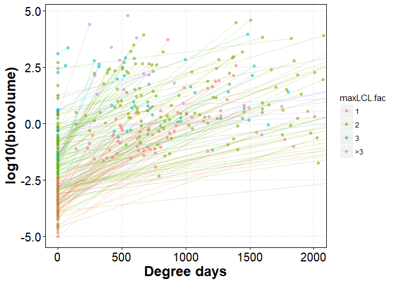

We can also calculate the growth rates and compare them directly between life cycles.

``` r
growth <- spread( select( ungroup(dataL.sp), Parasite.species, Stage, biovolume), key = Stage, value = biovolume) 

growth <- mutate(growth, rel_growth = log10(adult) - log10(preadult))

growth <- left_join(growth, 
                    filter( ungroup(dataL.sp), Stage == 'adult')%>%
                      select(Parasite.species, Parasite.group, dt, deg_days, maxLCL.fac))

growth <- mutate(growth, gr1 = rel_growth/dt, gr2 = rel_growth/deg_days)
```

There is a slight trend for growth rates to decrease with life cycle lengths.

``` r
ggplot(growth, aes(x = maxLCL.fac, y = gr1)) +
  geom_boxplot(outlier.color = 'white') +
  geom_jitter(height = 0, alpha = 0.5, width = 0.2) 
```

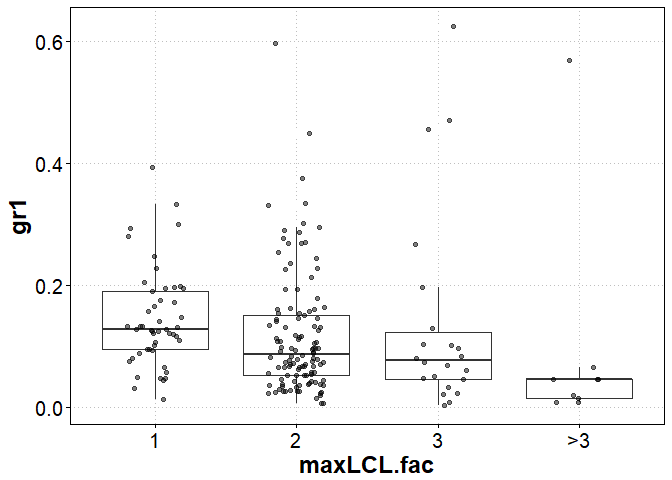

And this pattern is mainly driven by nematodes. They grow slower in longer life cycles.

``` r
ggplot(growth, aes(x = maxLCL.fac, y = gr1)) +
  geom_boxplot(outlier.color = 'white') +
  geom_jitter(height = 0, alpha = 0.5, width = 0.2) +
  facet_grid(~Parasite.group)
```

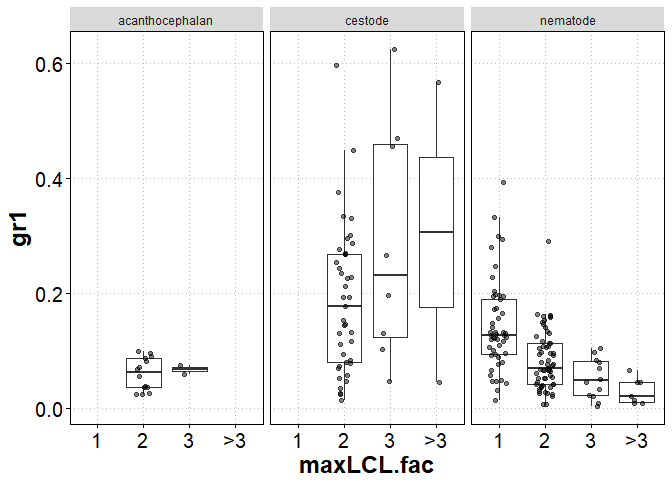

Simple vs complex in std dev

``` r
sd_growth <- select(growth, maxLCL.fac, gr1)%>%
  mutate(complex = if_else(maxLCL.fac == '1', 'simple', 'complex'),
         gr = 
           (gr1 - mean(gr1, na.rm=T) ) / sd(gr1, na.rm = T))
group_by(sd_growth, complex)%>%
  summarize(meangr_sd = mean(gr, na.rm = T))
```

    ## # A tibble: 2 x 2
    ##   complex   meangr_sd
    ##     <chr>       <dbl>
    ## 1 complex -0.05718526
    ## 2  simple  0.17155578
